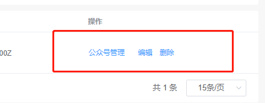

# 自定义扩展

可以扩展属于自己业务逻辑的组件

## 创建扩展包

执行下面命令，生成一个扩展包 

```bash
php artisan admin:extend name
#使用示例，以下会用这个名称来示例
php artisan admin:extend smallruraldog/miss-meijiu-admin
```

然后会在`Admin/Exends` 下创建一个扩展 `MissMeijiuAdmin`

检查你的项目`composer.json`配置文件，记住是项目的，不是扩展包的

```json
{
    //....
    "require": {
        //...
        "smallruraldog/miss-meijiu-admin": "*"
    },
    //...
    "repositories": {
        //....
        "0": {
            "type": "path",
            //请确认好扩展包的路径，要不然回安装失败
            "url": "app/Admin/Extends/MissMeijiuAdmin"
        }
    }
}
```

检查完成后执行

```shell
composer update
```

## 初始化扩展包

进入到扩展根目录

```bash
npm install
```

成功后执行

```base
npm run dev
```

开发模式自动编译

```bash
npm run watch
```

> 注意：如果失败，可能需要执行两次

编译

```bash
npm run production
```


## 目录结构说明

```
- dist //vue编译后的文件目录
- resource //前端文件目录
  - js
    - components //组件
    - extend.js //注册文件
  - sass
    - extend.scss //组件样式
- src
  - components //组件定义类
```

当然你还可以创建你的 路由  控制器  Model 等等，开发出一个具有业务逻辑的扩展

## 创建步骤

创建一个自定义组件需要三部

- 第一步：创建组件定义类

- 第二步：创建Vue组件

- 第三部：注册Vue组件

## 创建组件

### Form字段组件

在 `src/components`下创建一个PHP类

```php
namespace Smallruraldog\MissMeijiuAdmin\Components;

use SmallRuralDog\Admin\Components\Component;
//需要继承 Component
class GoodsSku extends Component
{
    //组件的名称，等下注册vue组件的时候名称需要一致
    protected $componentName = "GoodsSku";
    
    /** 示例属性 *******************************/
    
    //当前所有规格
    protected $goodsAttrs = [];
    //添加规格接口
    protected $addGoodsAttrUrl;
    protected $addGoodsAttrValueUrl;
    protected $uploadComponent;
    protected $imageComponent;
    /*********************************/
    
    //需要隐藏的属性，设置后不会在json中输出
    public $hideAttrs = [];
    
    public function __construct($value = [])
    {
        //字段初始值
        $this->componentValue($this->getValue([]));
        
        /** 示例代码 *******************************/
        $goodsAttrModel = new GoodsAttr();
        $this->goodsAttrs = $goodsAttrModel->allAttrs();
        $this->addGoodsAttrUrl = route("addGoodsAttr");
        $this->addGoodsAttrValueUrl = route("addGoodsAttrValue");
        $this->uploadComponent = Upload::make()->width(130)->height(130);
        $this->imageComponent = Image::make()->size(30, 30)->className("mr-10");
        /*********************************/
    }
    //定义一个make
    public static function make($value = [])
    {
        return new GoodsSku($value);
    }
    
    //自定义字段输出值，在表单编辑时使用
    public function getValue($data)
    {
        return [
            'goods_attrs' => [],
            'goods_sku_list' => []
        ];
    }
}
```

在`resources\js\components`下创建vue文件，例如`GoodsSku.vue`

```vue
<template>
  <!--这是属性示例用法-->
  <el-input
    :style="attrs.style"
    :class="attrs.className"
    :validate-event="attrs.validateEvent"
    :value="value" <!--绑定字段的值-->
    @input="onChange" <!--改变字段的值-->
  >
  </el-input>
</template>
<script>
    export default {
        props: {
            //组件类定义的属性
            attrs: Object,
            //当前表单的所有字段的值
            form_data: Object,
            //当前表单所有的item
            form_items: Array,
            //当前字段的值，注意：不一定的null
            value: {
                default: null
            }
        },
        data() {
            return {
            };
        },
        //上层实现了v-model功能
        model: {
            prop: "value",
            event: "change"
        },
        methods: {
            //改变字段的值
            onChange(value) {
                this.$emit("change", value);
            }
        }
    };
</script>
```

然后在`extend.js`中注册组件

```js
VueAdmin.booting((Vue, router, store) => {
    //....................
    Vue.component("GoodsSku", require('./components/GoodsSku').default),
});
```

在代码中使用组件

```php
$form->item("goods_sku", "产品规格")->displayComponent(GoodsSku::make())
```

### Grid字段组件

正在编写中....

### Grid字段编辑组件

正在编写中....

### Grid操作组件

自定义表格行操作



> 下面以ActionButton为例

创建一个组件类 继承 `BaseRowAction`

```php
class ActionButton extends BaseRowAction
{
    use Button;//导入Button属性
    
    protected $uri;
    protected $componentName = "ActionButton";
    protected $handler;

    public function __construct($content)
    {
        $this->content = $content;
        $this->type("text");
    }

    /**
     * @param string $content 按钮内容
     * @return ToolButton
     */
    public static function make($content)
    {
        return new ActionButton($content);
    }

    /**
     * @param mixed $uri
     * @return $this
     */
    public function uri($uri)
    {
        $this->uri = $uri;
        return $this;
    }

    /**
     * @param string $handler 响应类型 request|route|link
     * @return $this
     */
    public function handler($handler)
    {
        $this->handler = $handler;
        return $this;
    }
}
```

创建组件Vue文件

```vue
<template>
  <el-button
    :type="action.type"
    :size="action.size"
    :plain="action.plain"
    :round="action.round"
    :circle="action.circle"
    :disabled="action.disabled"
    :icon="action.icon"
    :autofocus="action.autofocus"
    :loading="loading"
    class="mr-10"
    @click="onClick"
    >{{ action.content }}</el-button
  >
</template>
<script>
export default {
  props: {
    scope: Object,//当前行的字段定义和数据
    action: Object,//当前主键的属性
    key_name: String//主键名称
  },
  data() {
    return {
      loading: false
    };
  },
  methods: {
    onClick() {
      //判断操作响应类型
      switch (this.action.handler) {
        case "route":
          this.$route.push(this.uri);
          break;
        case "link":
          window.location.href = this.uri;
          break;
        case "request":
          this.onRequest(this.uri);
          break;
        default:
          this.$Message.warning("响应类型未定义");
          break;
      }
    },
    onRequest(uri) {
      this.loading = true;
      this.$http
        .get(uri)
        .then(res => {
          if (res.code == 200) {
          }
        })
        .finally(() => {
          this.loading = false;
        });
    }
  },
  computed: {
    uri() {
      //替换变量 ,新版已经可以在php端获取当前行对象了
      let uri = this.action.uri;
      this._.forEach(this.row, (value, key) => {
        uri = this._.replace(uri, "{" + key + "}", value);
      });
      return uri;
    },
    //当前表格/树形表格的字段定义
    colum() {
      return this.scope.colum;
    },
    //当前行的值
    row() {
      return this.scope.row;
    },
    //主键值
    key() {
      return this.scope.row[this.key_name];
    }
  }
};
</script>
```

注册Vue组件

```js
Vue.component('ActionButton', require('xxx').default);
```

使用自定义组件

```php
$grid->actions(function (Grid\Actions $actions) {
	$actions->add(Grid\Actions\ActionButton::make("公众号管理")->order(3)->handler('route')->uri("WeChat/manage/{app_id}"));
});
```


### Grid工具栏组件


下面以ToolButton为例

按照国际惯例，创建组件类 继承`BaseAction`

```php
class ToolButton extends BaseAction
{
    use Button;
    protected $uri;
    protected $componentName = "ToolButton";
    protected $handler;

    public function __construct($content)
    {
        $this->content = $content;
    }

    /**
     * @param string $content 按钮内容
     * @return ToolButton
     */
    public static function make($content)
    {
        return new ToolButton($content);
    }

    /**
     * @param mixed $uri
     * @return $this
     */
    public function uri($uri)
    {
        $this->uri = $uri;
        return $this;
    }

    /**
     * @param string $handler 响应类型 request|route|link
     * @return $this
     */
    public function handler($handler)
    {
        $this->handler = $handler;
        return $this;
    }


}
```

创建vue文件

```php
<template>
  <el-button
    :type="attrs.type"
    :size="attrs.size"
    :plain="attrs.plain"
    :round="attrs.round"
    :circle="attrs.circle"
    :disabled="attrs.disabled"
    :icon="attrs.icon"
    :autofocus="attrs.autofocus"
    :loading="loading"
    class="mr-10"
    @click="onClick"
    >{{ attrs.content }}</el-button
  >
</template>
<script>
export default {
  props: {
      //组件属性
    attrs: Object
  },
  data() {
    return {
      loading: false
    };
  },
  methods: {
    onClick() {
      switch (this.attrs.handler) {
        case "route":
          this.$router.push(this.attrs.uri);
          break;
        case "link":
          window.location.href = this.attrs.uri;
          break;
        case "request":
          this.onRequest(this.attrs.uri);
          break;
        default:
          this.$Message.warning("响应类型未定义");
          break;
      }
    },
    onRequest(uri) {
      this.loading = true;
      this.$http
        .get(uri)
        .then(res => {
          if (res.code == 200) {
  
          }
        })
        .finally(() => {
          this.loading = false;
        });
    }
  }
};
</script>
```

注册Vue组件

```js
Vue.component('ToolButton', require('xxx').default);
```

调用组件

```php
$fansListGrid->toolbars(function (Grid\Toolbars $toolbars) use ($app_id) {
    $toolbars->hideCreateButton();
    $toolbars->addRight(Grid\Tools\ToolButton::make("同步粉丝")
                        ->icon("el-icon-refresh")
                        ->type("primary")
                        ->handler("request")
                        ->uri(route("WeChat/syncFans", ['app_id' => $app_id])));
});
```


### Page组件

如果内置的组件无法满足你的需求，那么就需要自定义了

创建组件定义类

```php
class MyPage extends Component
{
    protected $componentName = 'MyPage';
    
    public static function make()
    {
        return new MyPage();
    }
}
```

创建组件vue文件

```vue
<template>

</template>
<script>
    export default {
        props: {
            attrs: Object
        },
    };
</script>
<style lang="scss"></style>
```

调用组件

```php
public function index(Content $content)
{
    $content->body(MyPage::make());
    return $content;
}
```


## 组件通信

由于各个组件需要通信，所以需要监听或触发各种事件

```js
//监听事件
this.$bus.on("EventName",()=>{
})
//触发事件
this.$bus.emit("EventName")
//注销监听
this.$bus.off("EventName")
```


### 编辑数据加载完毕

由于编辑数据是异步加载的，在组件初始化的时候拿不到真正的数据

```js
mounted() {
    this.$bus.on("EditDataLoadingCompleted", () => {
        
    });
},
destroyed() {
    try {
        this.$bus.off("EditDataLoadingCompleted");
    } catch (e) {}
},
```

### 刷新表格

```js
this.$bus.emit("tableReload");
```

设置表格加载状态

```php
this.$bus.emit("tableSetLoading",true);

this.$bus.emit("tableSetLoading",false);
```

### 刷新内容区域

```php
this.$bus.emit("pageReload");
```

关闭Dialog

```php
this.$bus.emit("closeDialog");
```


更多事件正在开发中......